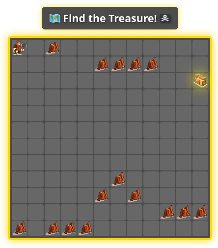
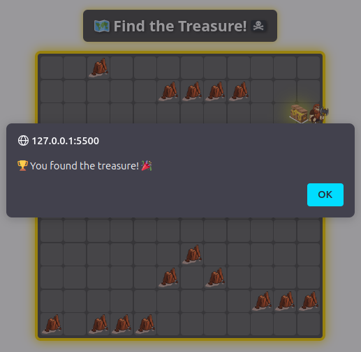

# 🏆 Treasure Quest - README 🏆

Welcome to **Treasure Quest**, a fun **grid-based adventure game** where you must navigate obstacles and find the **hidden treasure**! 🏴‍☠️

---

## 📜 How to Play  
1. Use the **arrow keys** (`← ↑ → ↓`) to **move** the player.  
2. Avoid the **rocks** (they are obstacles ❌).  
3. Find the **golden treasure** 🏆 to **win the game**! 🎉 

---

## 🎮 Features  
✅ **Bigger Grid** (12x12 for more adventure)  
✅ **Beautiful Design** (glowing effects, smooth animations)  
✅ **Obstacles** (randomly placed rocks for extra challenge)  
✅ **Dynamic Gameplay** (treasure location changes every game)  
✅ **Easy Controls** (simple arrow key movement)  

---

## 📸 Demo Screenshots  

### 🗺️ Game Start  
  

### 🏴‍☠️ Found the Treasure!  
  
